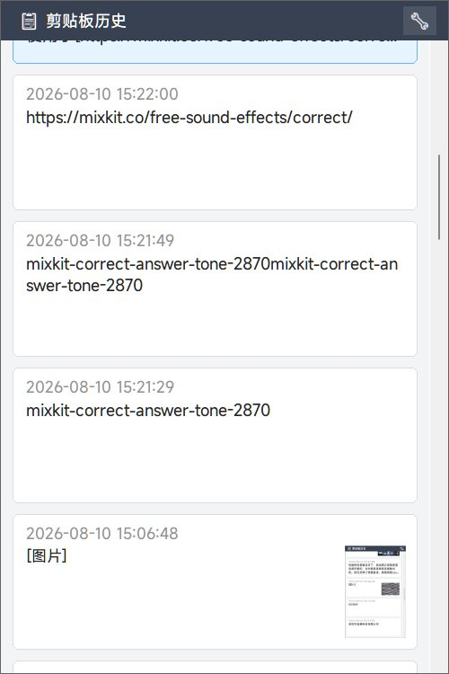

# VC Clipboard Manager

一个面向 Windows 的轻量级剪贴板历史管理器。

> **VC = Vibe Coding**

本项目是一个使用 Vibe Coding 工作流完成的原生 C++ Win32 应用。直接调用 Windows API 管理剪贴板、全局快捷键、系统托盘、缓存和开机启动。不依赖 Tauri、Electron 或浏览器运行时.

## 下载

前往 [Releases](https://github.com/Reisen-U/VC-Clipboard-Manager/releases) 下载最新版本的 `ClipboardManager.exe`。

程序采用便携式设计，无需安装。下载后直接运行即可；退出程序可以在系统托盘图标菜单中完成。

## 功能

- 在系统托盘中运行，支持全局快捷键唤出历史面板
- 保存并浏览文本、图片和文件列表
- 双击历史项即可粘贴回当前应用
- 支持文本自动换行、显示行数和字体大小调整
- 可设置历史记录条数和保留天数
- 图片异步生成 PNG 缓存和缩略图，不阻塞主界面
- 可选的复制提示音
- 可选开机自动启动；取消勾选并保存即可关闭
- 支持 Windows 非整数显示缩放（包括 125%）

默认快捷键：

- `Ctrl + Shift + V`
- `Alt + V`
- `Win + V`

快捷键可以在设置菜单中切换。

## 使用方式

1. 运行 `ClipboardManager.exe`。
2. 复制文本、图片或文件后，内容会自动进入历史记录。
3. 使用快捷键打开历史面板。
4. 双击需要的项目，将其粘贴到当前应用。
5. 亦可使用方向键选中，回车键粘贴
6. 右键点击托盘图标可以打开设置、缓存目录或清空历史记录。

## 界面截图



## 数据与设置

剪贴板历史默认保存在：

```text
%LOCALAPPDATA%\ClipManager
```

程序不需要管理员权限。

开机自动启动使用当前用户注册表项：

```text
HKEY_CURRENT_USER\Software\Microsoft\Windows\CurrentVersion\Run\VCClipboardManager
```

在设置菜单中取消“开机自动启动”并点击“保存并应用”，即可移除该启动项。

## 内存占用

在无历史记录、仅系统托盘常驻的情况下，当前版本实测如下：

| 指标 | 实测值 |
| --- | ---: |
| 专用工作集（Private Working Set） | 约 `18.5 MB` |
| 专用内存（Private Bytes） | 约 `24.2 MB` |
| 工作集（Working Set） | 约 `54.6 MB` |

实际占用会随 Windows 版本、显示缩放、历史条数、文本长度和图片数量变化；图片缩略图上限为 `220 × 160` 像素。以上数据仅作参考，不代表所有机器或所有使用场景。

## 为什么选择原生 Win32

相对于常见的 Tauri 或 Electron 剪贴板管理器，本项目具备：

- **无需 Chromium 或 WebView 运行时**：程序结构更简单，发布文件更小。
- **直接使用 Windows API**：剪贴板监听、全局热键、系统托盘、注册表启动项和文件缓存不需要跨语言桥接。
- **原生 DPI 处理**：使用 GDI/GDI+ 绘制，并启用 Per-Monitor V2 DPI 感知，适配 125% 等非整数缩放。
- **便携式运行**：下载单个 EXE 即可使用，不需要 Node.js、浏览器运行时或安装器。

## Vibe Coding 声明

本项目在 Vibe Coding 工作流中完成和迭代。开发过程中使用了以下模型协助设计、编写、调试和优化：

- Claude Opus
- GPT-5.6
- DeepSeek V4 Pro

已平稳运行3个月

## 音效来源

项目示例提示音来自 Mixkit 的 Correct 音效资源：

- [Mixkit — Correct sound effects](https://mixkit.co/free-sound-effects/correct/)

## 从源码构建

项目使用原生 Win32 C++、GDI/GDI+ 和 MinGW-w64 构建。

需要安装：

- MinGW-w64 g++
- GNU windres

在项目目录执行：

```bat
windres resource.rc -o resource.o
g++ main.cpp resource.o -o ClipboardManager.exe -mwindows -municode -static -lgdi32 -lshell32 -lole32 -lgdiplus -lwinmm -ladvapi32
```

也可以直接运行 `compile-command.bat`。`app.manifest` 会通过 `resource.rc` 嵌入程序，以确保 Windows 正确识别 DPI 感知设置。

## 许可

本项目使用 [MIT License](./LICENSE) 开源。
